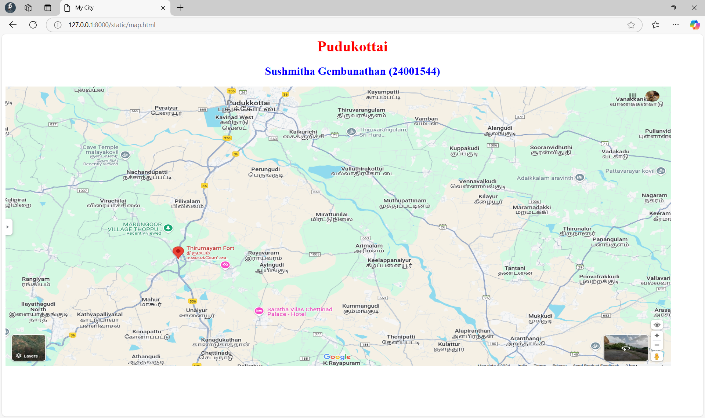
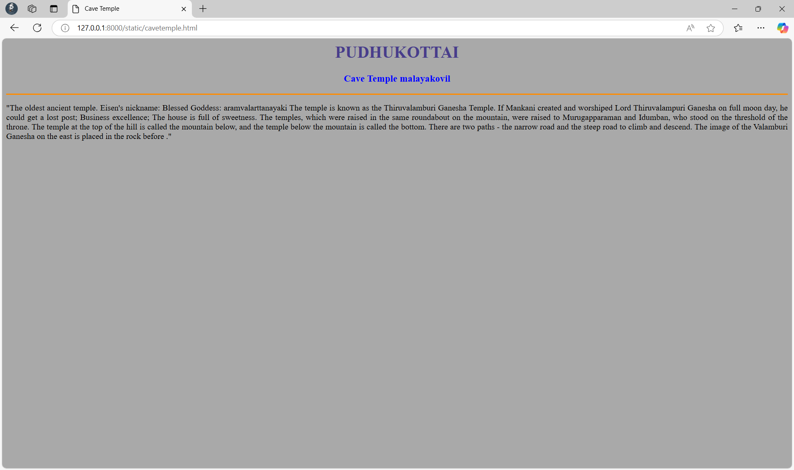
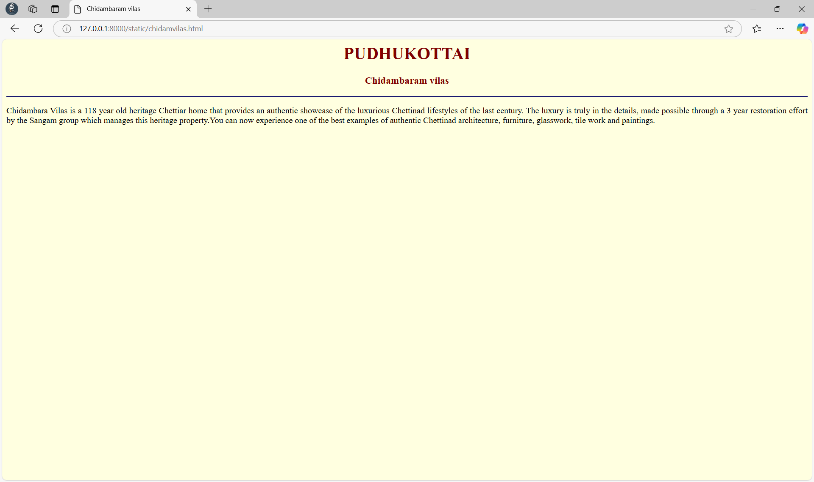
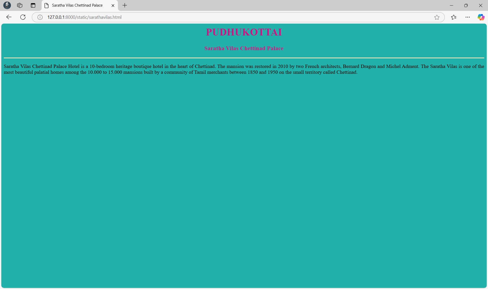
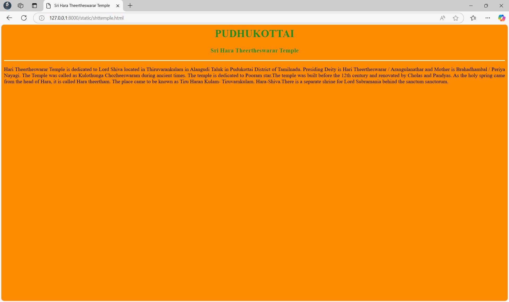
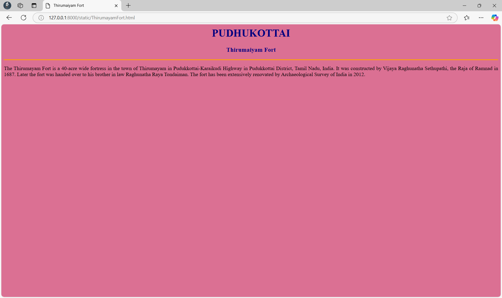

# Ex04 Places Around Me


## AIM
To develop a website to display details about the places around my house.

## DESIGN STEPS

### STEP 1
Create a Django admin interface.

### STEP 2
Download your city map from Google.

### STEP 3
Using ```<map>``` tag name the map.

### STEP 4
Create clickable regions in the image using ```<area>``` tag.

### STEP 5
Write HTML programs for all the regions identified.

### STEP 6
Execute the programs and publish them.

## CODE
```
map.html

<html>
<head>
<title>My HomeTown</title>
</head>
<body>
<h1 align="center">
<font color="red"><b>Pudhukottai</b></font>
</h1>
<h2 align="center">
<font color="blue"><b>Sushmitha Gembunathan (24001544)</b></font>
</h2>

<map name="image-map">
<area target="" alt="Thirumayam Fort" title="Thirumayam Fort" href="ThirumayamFort.html" coords="410,360,36" shape="circle">
<area target="" alt="Saratha Vilas Chettinad Palace" title="Saratha Vilas Chettinad Palace" href="sarathavilas.html" coords="560,498,36" shape="circle">
<area target="" alt="Sri Hara Theertheswarar Temple" title="Sri Hara Theertheswarar Temple" href="shttemple.html" coords="770,90,36" shape="circle">
<area target="" alt="Chidambaram vilas" title="Chidambaram vilas" href="chidamvilas.html" coords="490,400,36" shape="circle">
<area target="" alt="Cave Temple " title="Cave Temple " href="cavetemple.html" coords="100,100,300,200" shape="rect">
</map>
</body>
</html>

cavetemple.html

<html>
<head>
<title>Cave Temple</title>
</head>
<body bgcolor="DarkGrey">
<h1 align="center">
<font color="DarkSlateBlue"><b>PUDHUKOTTAI</b></font>    
</h1>
<h3 align="center">
<font color="blue"><b>Cave Temple malayakovil</b></font>    
</h3>
<hr size="3" color="#FF8C00">
<p align="justify">
<front face="Georgia" size="S">
"The oldest ancient temple. Eisen's nickname: Blessed Goddess: aramvalarttanayaki The temple is known as the Thiruvalamburi Ganesha Temple. If Mankani created and worshiped Lord Thiruvalampuri Ganesha on full moon day, he could get a lost post; Business excellence; The house is full of sweetness. The temples, which were raised in the same roundabout on the mountain, were raised to Murugapparaman and Idumban, who stood on the threshold of the throne. The temple at the top of the hill is called the mountain below, and the temple below the mountain is called the bottom. There are two paths - the narrow road and the steep road to climb and descend. The image of the Valamburi Ganesha on the east is placed in the rock before ." 
<p>
</body>
</html>

chidamvilas.html

<html>
<head>
<title>Chidambaram vilas</title>
</head>
<body bgcolor="LightYellow">
<h1 align="center">
<font color="Maroon"><b>PUDHUKOTTAI</b></font>    
</h1>
<h3 align="center">
<font color="Maroon"><b>Chidambaram vilas</b></font>    
</h3>
<hr size="3" color="MidnightBlue">
<p align="justify">
<front face="Georgia" size="S">
Chidambara Vilas is a 118 year old heritage Chettiar home that provides an authentic showcase of the luxurious Chettinad lifestyles of the last century. The luxury is truly in the details, made possible through a 3 year restoration effort by the Sangam group which manages this heritage property.You can now experience one of the best examples of authentic Chettinad architecture, furniture, glasswork, tile work and paintings. 
</body>
</html>


sarathavilas.html

<html>
<head>
<title>Saratha Vilas Chettinad Palace</title>
</head>
<body bgcolor="LightSeaGreen">
<h1 align="center">
<font color="MediumVioletRed"><b>PUDHUKOTTAI</b></font>    
</h1>
<h3 align="center">
<font color="MediumVioletRed"><b>Saratha Vilas Chettinad Palace</b></font>    
</h3>
<hr size="3" color="Moccasin">
<p align="justify">
<front face="Georgia" size="S">
Saratha Vilas Chettinad Palace Hotel is a 10-bedroom heritage boutique hotel in the heart of Chettinad. The mansion was restored in 2010 by two French architects, Bernard Dragon and Michel Adment. The Saratha Vilas is one of the most beautiful palatial homes among the 10.000 to 15.000 mansions built by a community of Tamil merchants between 1850 and 1950 on the small territory called Chettinad.
</body>
</html>

shttemple.html

<html>
<head>
<title>Sri Hara Theertheswarar Temple</title>
</head>
<body bgcolor="DarkOrange">
<h1 align="center">
<font color="ForestGreen"><b>PUDHUKOTTAI</b></font>    
</h1>
<h3 align="center">
<font color="ForestGreen"><b>Sri Hara Theertheswarar Temple</b></font>    
</h3>
<hr size="3" color="FloralWhite">
<p align="justify">
<front face="Georgia" size="S">
Hari Theertheswarar Temple is dedicated to Lord Shiva located in Thiruvarankulam in Alangudi Taluk in Pudukottai District of Tamilnadu. Presiding Deity is Hari Theertheswarar / Arangulanathar and Mother is Brahadhambal / Periya Nayagi. The Temple was called as Kulothunga Chozheeswaram during ancient times. The temple is dedicated to Pooram star.The temple was built before the 12th century and renovated by Cholas and Pandyas. As the holy spring came from the head of Hara, it is called Hara theertham. The place came to be known as Tiru Haran Kulam- Tiruvarnkulam. Hara-Shiva.There is a separate shrine for Lord Subramania behind the sanctum sanctorum. 
</body>
</html>

ThirumaiyamFort.html

<html>
<head>
<title>Thirumaiyam Fort</title>
</head>
<body bgcolor="PaleVioletRed">
<h1 align="center">
<font color="Navy"><b>PUDHUKOTTAI</b></font>    
</h1>
<h3 align="center">
<font color="Navy"><b>Thirumaiyam Fort</b></font>    
</h3>
<hr size="3" color="Orange">
<p align="justify">
<front face="Georgia" size="S">
The Thirumayam Fort is a 40-acre wide fortress in the town of Thirumayam in Pudukkottai-Karaikudi Highway in Pudukkottai District, Tamil Nadu, India. It was constructed by Vijaya Raghunatha Sethupathi, the Raja of Ramnad in 1687. Later the fort was handed over to his brother in law Raghunatha Raya Tondaiman. The fort has been extensively renovated by Archaeological Survey of India in 2012.
</body>
</html>
```

## OUTPUT








## RESULT
The program for implementing image maps using HTML is executed successfully.
